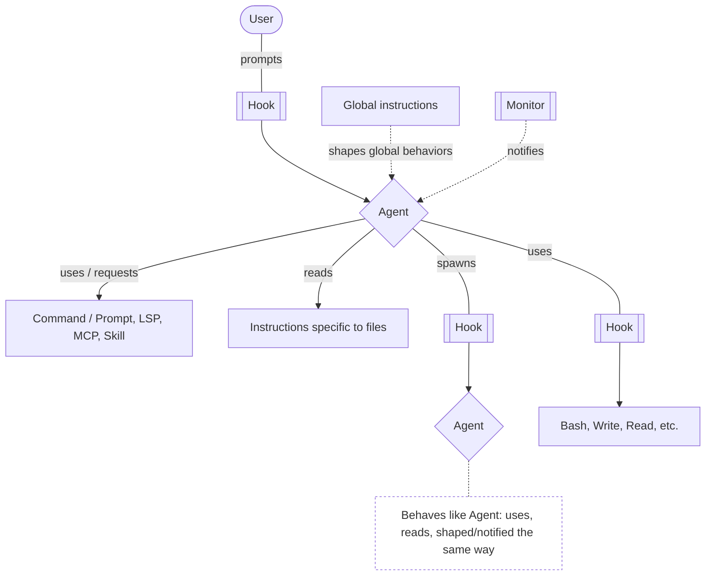

---
sidebar:
  open: true
title: Composants
weight: 10
---

Composants existants pour architecturer et optimiser le comportement des agents.

## Explorer



## Carte mentale

```mermaid
flowchart TD
    Agent{"Agent"}
    Component["Command / Prompt, LSP, MCP, Skill"]
    GlobalInstructions["Global instructions"]
    Instruction["Instructions specific to files"]
    Monitor[["Monitor"]]
    SubAgent{"Agent"}
    ToolUse["Bash, Write, Read, etc."]
    User(["User"])

    User ---|prompts| Hook1[["Hook"]] --> Agent
    Agent ---|uses| Hook2[["Hook"]] --> ToolUse
    Agent -->|uses / requests| Component
    Agent -->|reads| Instruction
    Agent ---|spawns| Hook3[["Hook"]] --> SubAgent

    GlobalInstructions -.->|shapes global behaviors| Agent
    Monitor -.->|notifies| Agent

    NoteSubAgent["Behaves like Agent: uses, reads, shaped/notified the same way"]
    SubAgent -.- NoteSubAgent

    classDef note fill:none,stroke-dasharray: 3 3
    class NoteSubAgent note
```

