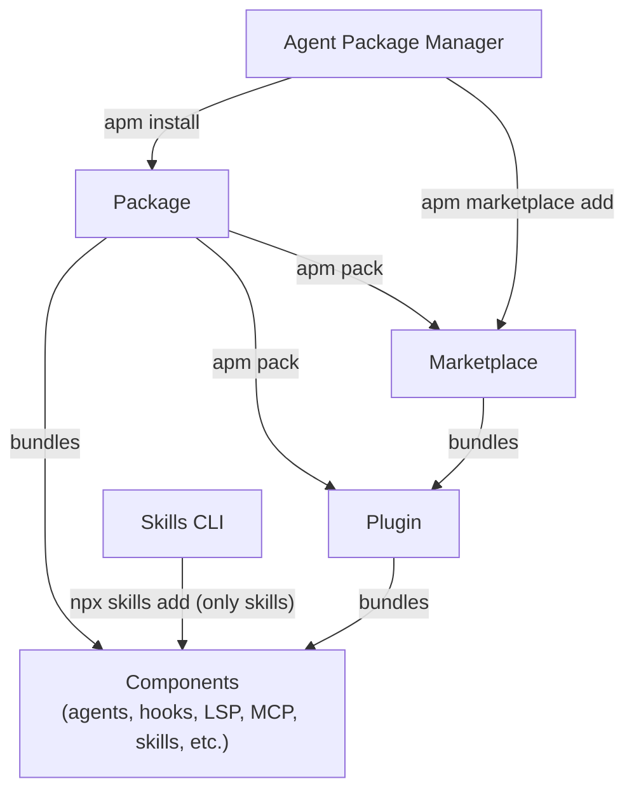

Stop sharing components through copy/paste,
use real implementation tooling to ease maintenance, updates and enforce security.

## Explore



## Mental Map

```mermaid
flowchart TD
    APM["Agent Package Manager"]
    Components["Components<br/>(agents, hooks, LSP, MCP, skills, etc.)"]
    Marketplace["Marketplace"]
    Package["Package"]
    Plugin["Plugin"]
    SkillsCLI["Skills CLI"]

    Marketplace -->|bundles| Plugin
    Plugin -->|bundles| Components

    Package -->|bundles| Components
    Package -->|apm pack| Plugin
    Package -->|apm pack| Marketplace

    APM -->|apm install| Package
    APM -->|apm marketplace add| Marketplace

    SkillsCLI -->|"npx skills add (only skills)"| Components
```

