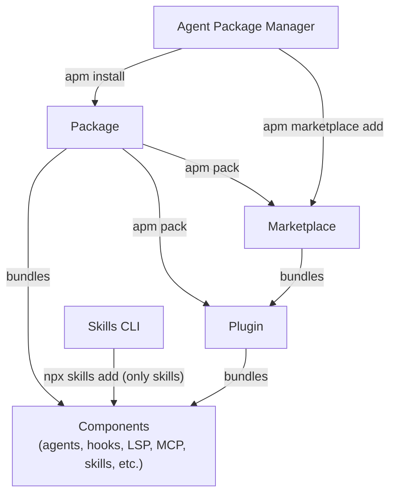

Sharing AI components (agents, hooks, LSP, MCP, skills, etc.) can be done through multiple ways.

Because while the simple way of just copying / pasting an instruction is fine,
is has limitations regarding updates, security, discovery and naming conflits.
It is also not optimal when many components are shared within a company or even a project.

That's why AI companies (mainly) introduced some concepts to share components that are nowadays available through the majority of agents:



## Mental Map

